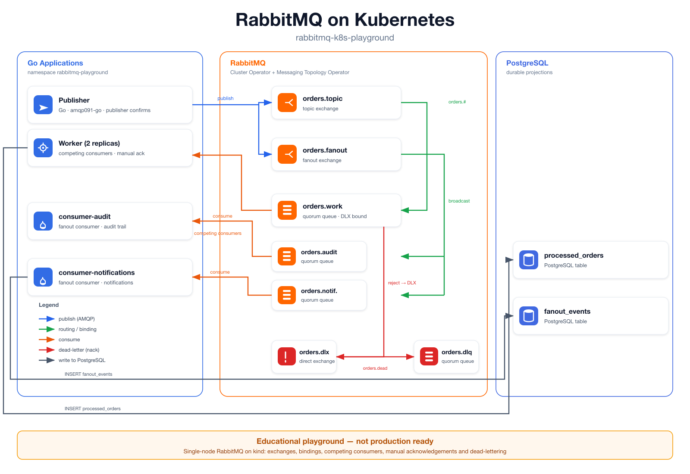

<p align="center">
  
</p>

<h1 align="center">RabbitMQ K8s Playground</h1>

<p align="center">

An Open Source Proof of Concept demonstrating RabbitMQ on Kubernetes with topic and fanout exchanges, competing consumers, manual acknowledgements and dead-letter queues.

This repository is an educational playground. It is not a production-ready platform.

</p>

<p align="center">

[](LICENSE)
[](https://www.rabbitmq.com/)
[](https://kubernetes.io/)
[](https://go.dev/)
[](https://www.postgresql.org/)

</p>

---

# 📖 Overview

This Proof of Concept demonstrates the core **AMQP messaging** patterns with **RabbitMQ** running on **Kubernetes** through the **RabbitMQ Cluster Operator** and the **Messaging Topology Operator**.

A single Go publisher sends order events to two exchanges at the same time:

- a **topic exchange** (`orders.topic`) routes work messages by routing key (`orders.created`, `orders.shipped`, `orders.cancelled`) to a **work queue** (`orders.work`) consumed by several **competing consumers**;
- a **fanout exchange** (`orders.fanout`) **broadcasts** every order to two independent queues (`orders.audit`, `orders.notifications`) consumed by two dedicated consumers.

The playground demonstrates the key RabbitMQ concepts:

- **exchanges** (topic, fanout, direct) and **bindings** as code, declared by the Messaging Topology Operator;
- **competing consumers** sharing a single quarantine-safe **quorum queue**;
- **manual acknowledgements** with fair dispatch (`prefetch`);
- **publisher confirms** for reliable publishing;
- **dead-lettering** of poison messages to a dedicated **dead-letter queue** through a dead-letter exchange.

---

# 🏗️ Architecture

<p align="center">
  
</p>

---

# 🧩 Components

### 📨 Publisher

A Go application (using the [`amqp091-go`](https://github.com/rabbitmq/amqp091-go) client) that:

- connects to RabbitMQ with **publisher confirms** enabled;
- publishes each order to the topic exchange with a routing key;
- publishes the same order to the fanout exchange for broadcasting;
- exposes an HTTP control API (`GET /publish?count=N&poison=M`) used by the test scripts.

Order format:

```json
{"orderNb":"ORD-00001","customerName":"Alice","amount":"10.50","routingKey":"orders.created","poison":false}
```

---

### 🐰 RabbitMQ (Cluster Operator)

A single-node RabbitMQ cluster provisioned by the **RabbitMQ Cluster Operator** in the `rabbitmq-playground` namespace.

- Service: `rabbitmq` (AMQP `5672`, management UI `15672`, Prometheus `15692`);
- Default credentials stored in the `rabbitmq-default-user` Secret;
- Topology (exchanges, queues, bindings) declared by the **Messaging Topology Operator**.

---

### 📮 Topology (Messaging Topology Operator)

| Object | Kind | Purpose |
| --- | --- | --- |
| `orders.topic` | topic exchange | Routes work messages by routing key. |
| `orders.fanout` | fanout exchange | Broadcasts every order to all bound queues. |
| `orders.dlx` | direct exchange | Dead-letter exchange. |
| `orders.work` | quorum queue | Competing consumers, dead-lettered to `orders.dlx`. |
| `orders.dlq` | quorum queue | Dead-letter queue for poison messages. |
| `orders.audit` | quorum queue | Fanout consumer `audit`. |
| `orders.notifications` | quorum queue | Fanout consumer `notifications`. |

---

### 👷 Worker (competing consumers)

A Go application running with **2 replicas**. Each replica consumes the shared `orders.work` queue:

1. sets `prefetch=1` for fair dispatch;
2. validates the message;
3. rejects poison messages (`Nack requeue=false`) so they are dead-lettered to `orders.dlq`;
4. writes the order to PostgreSQL and acknowledges only **after** the write succeeded.

Because both replicas share the same queue, every message is processed by **exactly one** replica.

---

### 🔔 Fanout Consumers

Two Go applications (`consumer-audit`, `consumer-notifications`) that each consume their own queue bound to `orders.fanout`:

- both receive **every** published order (broadcast);
- each records the received event in the `fanout_events` PostgreSQL table.

---

### 🗄 PostgreSQL

Durable storage used to observe the messaging behaviour.

Tables: `processed_orders` (`order_nb`, `routing_key`, `worker`, `processed_at`) and
`fanout_events` (`mode`, `order_nb`, `poison`, `received_at`).

---

# 🎯 Objective

This Proof of Concept demonstrates how to:

- deploy **RabbitMQ on Kubernetes** with the RabbitMQ Cluster Operator;
- provision **exchanges, queues and bindings as code** with the Messaging Topology Operator;
- publish reliably with **publisher confirms**;
- distribute work to **competing consumers** through a **quorum queue**;
- **broadcast** events to independent consumers through a **fanout exchange**;
- acknowledge messages **manually** and route failures to a **dead-letter queue**.

---

# ⚙️ Prerequisites

- Docker
- Kind (`kind`)
- `kubectl`
- Make
- Go 1.25+ (only to build / run the apps locally)

The deployment installs three cluster-wide components automatically: the
RabbitMQ Cluster Operator, cert-manager and the RabbitMQ Messaging Topology Operator.

---

# 🚀 Installation

This PoC deploys to a local **kind** cluster. Provision everything with:

```bash
make deploy
```

The script performs the following steps:

1. creates a kind cluster (`rabbitmq-k8s`);
2. installs the **RabbitMQ Cluster Operator** into the `rabbitmq-system` namespace;
3. installs **cert-manager** and the **Messaging Topology Operator** (declarative topology);
4. builds and loads the three Go application images into kind;
5. deploys PostgreSQL, the RabbitMQ cluster and the AMQP topology;
6. deploys the publisher, the workers and the two fanout consumers.

The defaults can be overridden when needed:

```bash
make deploy CLUSTER=my-cluster TAG=dev
```

---

# 🧪 Verification

Inspect all running resources:

```bash
make status
```

Watch the **worker** process work messages:

```bash
make logs-worker
```

Expected output:

```text
✅ processed ORD-00001 customer=Alice routingKey=orders.created worker=worker-xxxxx
```

Watch a **fanout consumer** receive every broadcast order:

```bash
make logs-audit
```

Expected output:

```text
🔔 [audit] received ORD-00001 customer=Alice
```

Show the **queue depths** (including the dead-letter queue):

```bash
make queues
```

Expected output:

```text
name                  type    messages
orders.work           quorum  0
orders.dlq            quorum  3
orders.audit          quorum  0
orders.notifications  quorum  0
```

Open the RabbitMQ **management UI**:

```bash
make ports
# then browse http://localhost:15672
```

Or run the consolidated checks:

```bash
make verify
```

---

# 🧪 Testing

The playground ships three behavioural tests, each driven by the publisher control API.

### 👷 Competing consumers (`orders.work`)

```bash
make test-work-queue
```

Publishes `COUNT` orders (default 20) and asserts that the number of rows in
`processed_orders` grows by at least `COUNT`, proving that the two worker replicas
share the queue and each message is processed by exactly one replica.

### 🔔 Fanout broadcast

```bash
make test-fanout
```

Publishes orders and asserts that both the `audit` and `notifications` consumers
received the **same** number of messages, proving that a fanout exchange delivers
every message to every bound queue.

### ☠️ Dead-letter queue

```bash
make test-dead-letter
```

Publishes poison messages (`customerName = "POISON"`) and asserts that the
`orders.dlq` depth grows, proving that rejected messages are dead-lettered
through `orders.dlx`.

Run them all at once:

```bash
make test
```

---

## 🎬 Demo

The demo shows the live logs of the publisher, the workers and the two fanout
consumers, followed by the queue depths and the data persisted in PostgreSQL.

The main commands are:

| Command | Description |
| --- | --- |
| `make help` | List all available commands. |
| `make build` | Build the three local application images. |
| `make deploy` | Create the kind cluster and deploy the playground. |
| `make verify` | Check workloads, queue depths and persisted data. |
| `make status` | Display the Kubernetes resources. |
| `make queues` | Show the RabbitMQ queue depths. |
| `make ports` | Port-forward the management UI and the AMQP port. |
| `make logs-publisher` | Follow the publisher logs. |
| `make logs-worker` | Follow the worker logs. |
| `make logs-audit` | Follow the audit fanout consumer logs. |
| `make logs-notifications` | Follow the notifications fanout consumer logs. |
| `make test` | Run the full behavioural test suite. |
| `make cleanup` | Remove the resources while keeping the kind cluster. |
| `make destroy` | Remove the resources and delete the kind cluster. |

---

# 📚 What You Will Learn

- How to run RabbitMQ on Kubernetes with the Cluster Operator.
- How to declare exchanges, queues and bindings with the Messaging Topology Operator.
- How **topic** routing keys select a work queue, and how a **fanout** exchange broadcasts.
- How **competing consumers** share a quorum queue with fair dispatch.
- How **manual acknowledgements** and **publisher confirms** provide reliability.
- How to dead-letter poison messages to a dedicated queue.

> [!IMPORTANT]
> This workflow illustrates AMQP patterns in a disposable single-node environment.
> For production messaging, evaluate clustering and quorum queues across multiple
> nodes, TLS, vhost isolation, resource policies, monitoring and backup strategies.

---

# 🧹 Cleanup

Remove the playground resources (keeps the kind cluster):

```bash
make cleanup
```

To also delete the kind cluster:

```bash
make destroy
```

---

# 📚 References

- [RabbitMQ Documentation](https://www.rabbitmq.com/docs)
- [AMQP 0-9-1 Model Explained](https://www.rabbitmq.com/tutorials/amqp-concepts)
- [Dead Lettering](https://www.rabbitmq.com/docs/dlx)
- [Quorum Queues](https://www.rabbitmq.com/docs/quorum-queues)
- [Publisher Confirms](https://www.rabbitmq.com/docs/confirms)
- [RabbitMQ Cluster Operator](https://www.rabbitmq.com/kubernetes/operator/operator-overview)
- [RabbitMQ Messaging Topology Operator](https://www.rabbitmq.com/kubernetes/operator/using-topology-operator)
- [amqp091-go — Go client for RabbitMQ](https://github.com/rabbitmq/amqp091-go)
- [PostgreSQL Official Documentation](https://www.postgresql.org/docs/)
- [Kind — Kubernetes in Docker](https://kind.sigs.k8s.io/)

---

# 🏛 About OpenMind Systems Lab

OpenMind Systems Lab is an independent French non-profit association dedicated to research, experimental development and technical benchmarking in Cloud Native technologies.

Our mission is to produce practical, reproducible and educational Open Source Proofs of Concept covering Kubernetes, Platform Engineering, Distributed Messaging, Infrastructure Security and Artificial Intelligence.

GitHub Organization:

https://github.com/openmind-systems-lab

---

<p align="center">
Made with ❤️ by OpenMind Systems Lab
</p>
